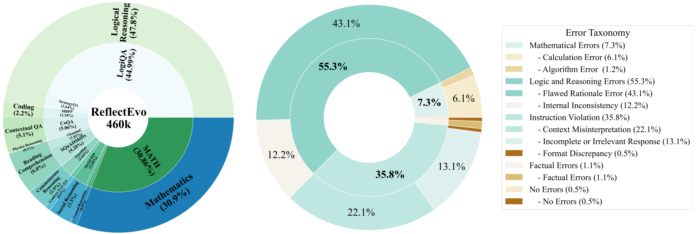
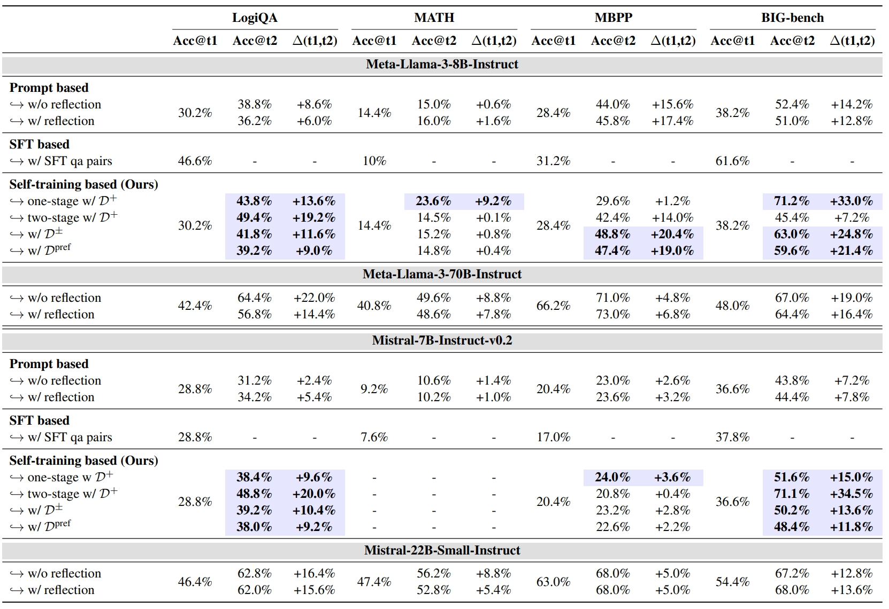

<h1 align="center">ReflectEvo: Improving Meta Introspection of Small LLMs  by Learning Self-Reflection</h1>

  
<p align="center">
    <a href="https://huggingface.co/datasets/bigai-nlco/ReflectionEvo">
        
    </a>
    <a href="https://arxiv.org/abs/2505.16475">
        
    </a>
</p>


**Novel Pipeline for Self-Reflection Generation** : automatic self-reflection generation and curation, which is the first to explore *meta introspection* of SLMs.

**Large-Scale and Diverse Self-generated Reflection Dataset** : a comprehensive reflection training set *ReflectEvo-460K* from 17 source datasets spanning 10 tasks including various reflection instructions and comparative samples.

**Learning Reflection Via Self-training**: four settings of reflection learning through self-reflection and self-correction based on SFT and DPO, which significantly boost the reasoning abilities of SLMs


## 📌Statistics of ReflectEvo-460K





## 📖 Table of contents
- [Installation](#installation)
- [Reflection Generation](#reflection-generation)
- [Reflection Learning through Self-training](#training-guide)
- [Evaluation](#evaluation)
  - [Generate prediction results](#generate-results)
  - [Performance Evaluation](#evaluate-performance)
- [Results](#results)
- [Citation](#citation)

  
## 💁 Installation

   ```bash
   git clone https://github.com/Sheng-Shu/ReflectEvo.git
   cd ReflectEvo
   conda activate reflectevo
   pip install -r requirements.txt
   ```

   
## 🤔 Reflection Generation

You can download the whole set of our **ReflectEvo-460K** here  ([🤗 HF Repo](https://huggingface.co/datasets/bigai-nlco/ReflectionEvo)). The sample data can also be referenced quickly [data/examples](data/examples).

For Reflection Generation, run
```bash
python -m run.run --dataset Logiqa -model_name your_model_path --demand_type 1
```

Tasks can be specified via `--dataset` including LogiQA, MATH, MBPP, BIG-bench, and BIG-benchfree (a filtered subset with free-text answers from BIG-bench).

You can also determine the instructions to generate reflections through `--demand_type`.  Types of various instructions from the instruction pool can be seen in Appendix C.1 in the paper for details. You are also encouraged to add your own reflection instruction here.


## 🚀 Reflection Learning

For two stage training with D<sup>+</sup>, first train the capability of self-reflection:

```bash
PYTHONPATH=. torchrun --master-port 5508 --nproc_per_node=1 train/train_SFT_two_stage_1.py \
    --task logiqa \
    --num_epochs 3 \
    --resume False \
    --output output_path \
    --model_path your_model_path \
    ---ebs 20 \
    --bs 8 \
    --ss steps \
    --wd 0.01 \
    --lr 1e-3 \
    --gas 4
```

then train the self-correction:
```bash
PYTHONPATH=. torchrun --master-port 5507 --nproc_per_node=1 train/train_SFT_two_stage_2.py  \
    --task logiqa \
    --num_epochs 5 \
    --resume False \
    --output output_path \
    --model_path your_model_path \
    --ss steps \
    --ebs 50  \
    --bs 8 \
    --wd 0.01 \
    --lr 1e-3 \
    --gas 4 \
    --folder training_data_path 
```

For one stage training with D<sup>+</sup>:
```bash
PYTHONPATH=. python train/train_SFT_one_stage.py \
    --task logiqa \
    --input_data training_data_path \
    --output output_path \
    --model_path your_model_path \
```

For Direct Preference Optimization(DPO) training with both D<sup>±</sup> and D<sup>pref</sup>:
```bash
ACCELERATE_LOG_LEVEL=info accelerate launch --config_file configs/deepspeed_zero3.yaml --num_processes=4 run_dpo.py configs/DPO_train_config.yaml
```

## 📊 Evaluation
### Generate prediction results
The prediction during inference includes the first trial reasoning, reflection and the second trial reasoning with corrected answer. 
Generate the predictions for one-stage training on D<sup>+</sup> and DPO training on D<sup>±</sup> and D<sup>pref</sup>:

```bash
python -m run.run --dataset Logiqa --is_test True  --model_name your_model_path --model_config model_config
```
For two-stage training on D<sup>+</sup>:

```bash
python -m run.run_PEFT --dataset Logiqa --is_test True  --model_name your_model_path --model_config model_config
```

`--is_test` is set to "True" for evaluation. `--model_config` is used to specify the two models used for reasoning (Generator) and reflection after reflection learning (Reflector).

### Performance Evaluation

Automatic evaluation on most tasks:

```bash
python -m eval.count "path_to_prediction_results"
```

Automatic evaluation on questions with free-text answers in BIG-bench:

```bash
python -m eval.count_f1 "path_to_prediction_results"
```

## ✅ Results




## 📝 Citation
If you would like to use our data or find our work interesting, please cite:
```bibtex
@article{li2025reflectevo,
  title={ReflectEvo: Improving Meta Introspection of Small LLMs by Learning Self-Reflection},
  author={Li, Jiaqi and Dong, Xinyi and Liu, Yang and Yang, Zhizhuo and Wang, Quansen and Wang, Xiaobo and Zhu, SongChun and Jia, Zixia and Zheng, Zilong},
  journal={arXiv preprint arXiv:2505.16475},
  year={2025}
}
```

