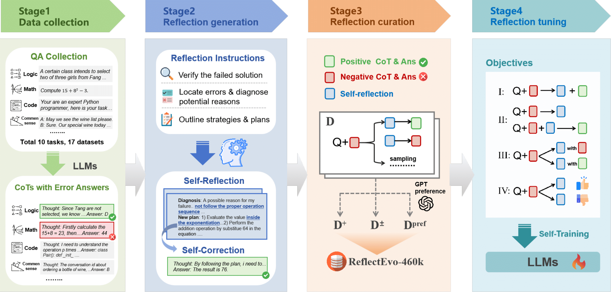
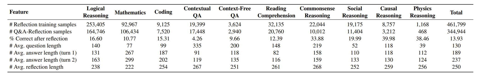

<h1 align="center">Improving Meta Introspection of Small LLMs by Learning Self-Reflection from Self-Generated Data</h1>
<p align="center">

We propose a novel pipeline **ReflectEvo**, to automatically generate self-reflection data and leverage self-training to enhance LLM’s reflection capability. 

Building on this pipeline, we curate a large scale, diverse, and unsupervised reflection learning dataset **ReflectEvo-460k** containing 460k reflection samples derived from 17 source datasets spanning 10 tasks and domains.



*Overview pipeline of ReflectEvo.* There are four key stages: (1) Initial thoughts and answers are collected from 10 tasks and 17 datasets, (2) Reflection Generation for erroneous samples including self-reflection and self-correction, (3) Reflection curation with positive, negative, and self-reflection samples, and (4) Reflection Tuning to enhance LLMs via self-training.

## 📖 Table of contents
- [Statistics of ReflectEvo-460K](#statistics-of-reflectevo-460k)
- [Installation](#installation)
- [Reflection Generation](#reflection-generation)
  - [Download the Data](#download-the-data)
  - [Generate Reflection](#generate-reflection)
- [Training Guide](#training-guide)
- [Evaluation](#evaluation)
  - [Generate Results](#generate-results)
  - [Evaluate Performance](#evaluate-performance)
- [Citation](#citation)
- [Acknowledgment](#acknowledgment)
  
## 📌Statistics of ReflectEvo-460K

## Installation
Clone this repository and navigate to ReflectEvo folder
   
   ```
   git clone https://github.com/Sheng-Shu/ReflectEvo.git
   cd ReflectEvo
   ```
   
Install Package
   
   ```
   pip install -r requirements.txt
   ```
   
## Reflection Generation
### Download the Data
You can download the **ReflectEvo-460K** data here: 

You can also access our sample data [data/](data/).

### Generate Reflection
For Reflection Generation, run
```
python run.py --method COT --dataset Logiqa --demand_type 1 --model_name /path/to/model
```


## Training Guide

For full-parameter SFT, first use
```
torchrun --master-port 5508 --nproc_per_node=1 train_c3.py --version 1 --task bigbenchfree --num_epochs 3 --resume False --output llama-3-bb-c5 --model_path Meta-Llama-3-8B-Instruct --template 1 --ebs 20 --bs 8 --ss steps --wd 0.01 --lr 1e-3 --gas 4
```

then use
```
torchrun --master-port 5507 --nproc_per_node=1 train.py --version 1 --task bigbenchfree --num_epochs 5 --resume False --output llama-3-bb-c2 --model_path Meta-Llama-3-8B-Instruct --template 1 --ss steps --ebs 50 --bs 8 --wd 0.01 --lr 1e-3 --gas 4 --folder data_train
```

For parameter-efficient fine-tuning (PEFT), use
```
python run_SFT_two_stage.py --task logiqa --input_data /path/to/training/data --output /path/to/output --model_path /path/to/model
```

For DPO, use
```
ACCELERATE_LOG_LEVEL=info accelerate launch --config_file accelerate_configs/deepspeed_zero3.yaml --num_processes=4 run_dpo.py training_configs/your_model_config
```

## Evaluation
### Generate Results

For evaluation, use the following command to test the performance of the model for both one stage training and DPO training:

```
python run.py --method COT --dataset Logiqa --is_test True  --model_name /path/to/model --model_config /path/to/model/config
```

Use the following command to test the performance of the model for two stage training:

```
python run_two_stage.py --method COT --dataset Logiqa --is_test True  --model_name /path/to/model --model_config /path/to/model/config
```


### Evaluate Performance

For datasets with multiple-answer questions, use the following command to evaluate the model's performance:

```
python eval/count.py "path/to/your/results"
```

For questions with free-text answers, use the following command to evaluate the model's performance:

```
python eval/count_f1.py "path/to/your/results"
```

## Citation

## Acknowledgment

